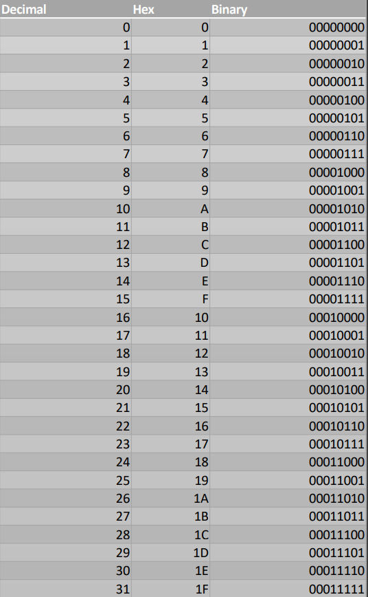

## Topics Covered
- Number Systems
  - Positional Numbering Systems
  - Converting from Decimal to Binary
  - Converting between bases
  - Decimal to Hex to Binary
  
### Number Systems

- A bit is the most basic unit of information in a computer
  - Bit -> Binary Digit
  - Either on/off
  - Either High/Low Voltage 
  
- A byte is 8 bits
  - Smallest addressable unit in computer storage (retrieved from memory)
  
- In Intel Assembly
  - Word = 2 bytes
  - double word = 4 bytes
  - quad word = 8 bytes
  
- <b>Fun Fact: Computers today are almost all quad words</b>

### - Positional Numbering Systems -

- Decimal (base 10)
  - 1465 10  = (1 x 10 3 ) + (4 x 10 2 ) + 6 x 10 1 ) + (5 x 10 0 ) = 1000 + 400 + 60 + 5
  
- Any integer can be shown in any base (<b>radix</b>)

- Common bases
  - Decimal (10)
  - Binary (2)
  - Hexadecimal (16)
  - Octal (8)

- Examples
  - 101 2  = (1 x 2 2 ) + (0 x 2 1 ) + (1 x 2 0 ) = 5 10 
  - 2AF 16  = ?
  
### - Converting from Decimal to Binary -

- Encode between different bases by using long division

- Convert 115 10  to binary
  - 115 10  = (1 x 10 2 ) + (15 x 10 0 ) = 100 + 15 = 01110011

 128 | 64 | 32 | 16 | 8 | 4 | 2 | 1 
 --- | --- | --- | --- | --- | --- | --- | ---
 0 | 1 | 1 | 1 | 0 | 0 | 1 | 1
 
 0 + 64 + 32 + 16 + 0 + 0 + 2 + 1 = 115
 
 ### - Converting between bases -
 - Convert 100.1101 2 
  - 100.1101 2  = (1 x 2 2 ) + (0 x 2 1 ) + (0 x 2 0 ) + (1 x 2 -1 ) + (1 x 2 -2 ) + (0 x 2 -3 ) + (1 x 2 -4 ) = (4.8125) 10 
  
 - Convert 4.8125 10 
  - 4.8125 10  = 100.1101
  
 ### - Decimal to Hex to Binary Conversion Table -
 
