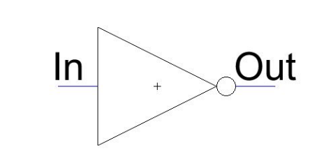

## Topics Covered
- Logic Gates
  - NOT Gate
  - AND Gate
  - OR Gate
  - Multi-Input Gates
  - Multi-Gate Systems

- Additional Gates
  - Exclusive NOR (XNOR)
  
### Logic Gates

- Building parts of a digital system help manipulate data

- Computational
  - Output is a function of only the current inputs
  
- A truth table can be used to model the relationship between a gate's input and outputs

### - NOT Gate -

- Inverters
  - Performs logical inversion of input
  - 1 goes in and 0 comes out and vice versa
  
  
