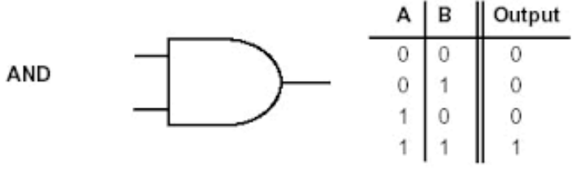
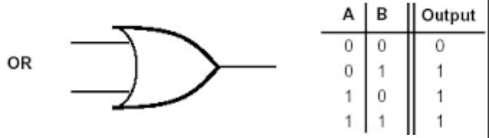
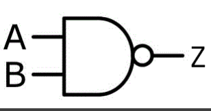
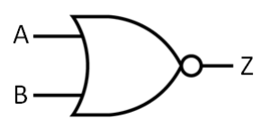

## Topics Covered
- Logic Gates
  - NOT Gate
  - AND Gate
  - OR Gate
  - Multi-Input Gates
  - Multi-Gate Systems

- Additional Gates
  - Exclusive NOR (XNOR)
  
### Logic Gates

- Building parts of a digital system help manipulate data

- Computational
  - Output is a function of only the current inputs
  
- A truth table can be used to model the relationship between a gate's input and outputs

### - NOT Gate -

- Inverters
  - Performs logical inversion of input
  - 1 goes in and 0 comes out and vice versa
  
  

### - AND Gate -

- Outputs 1 only if all inputs are 1 as well



### - OR Gate -

- Outputs a 1 if any of the inputs are 1 or all inputs are 1

- True if A is true or if B is true or if A and B are true



```
{
  if (A == True || B == True || (A == True && B == True))
    // then its true
}
```

### - Multiple Input Gates -

- We can construct many input gates using a combination of two input gates
  - 3 input AND gate
  - 3 input OR gate
  
### - Multi-Gate Systems -

- Can combine different gates to achieve an unholy complex system

- C = (( not(a) and b) or ( not(b) and a))

### Additional Gates

- Gates built with inverters
  - Common ones
     - NAND
     - NOR
     



### - Exclusive OR -

### - Exclusive NOR (XNOR) -
